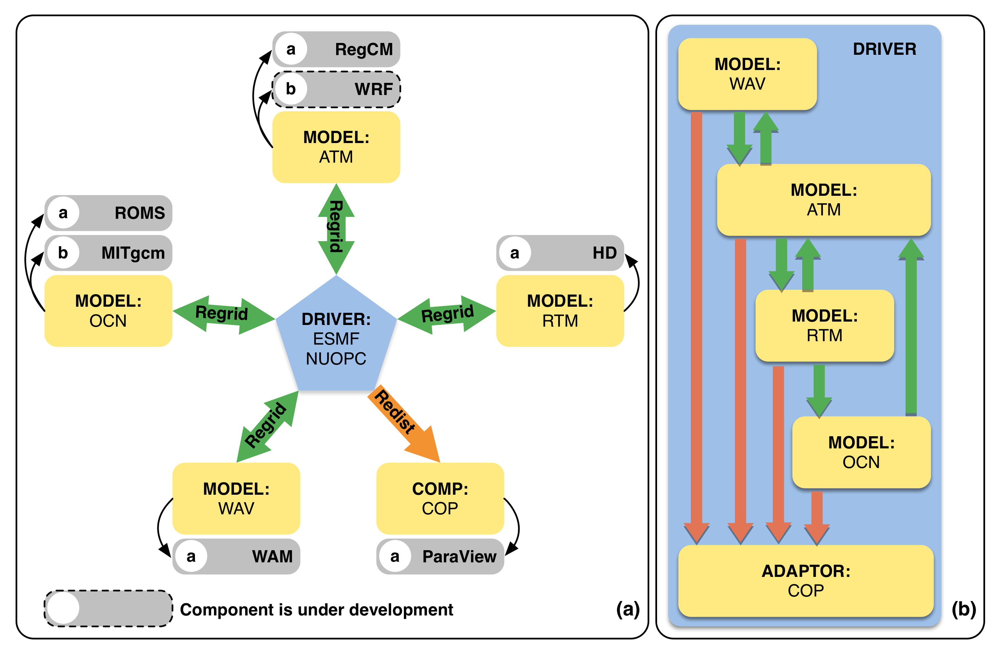
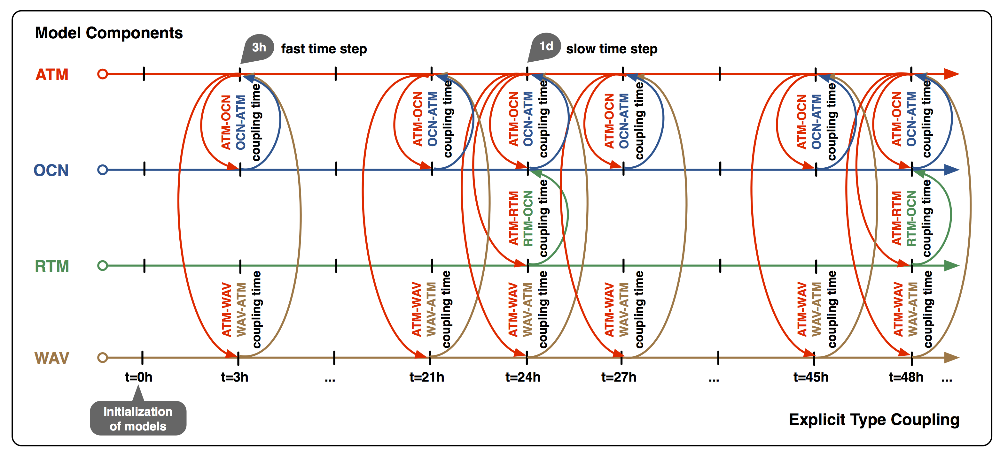
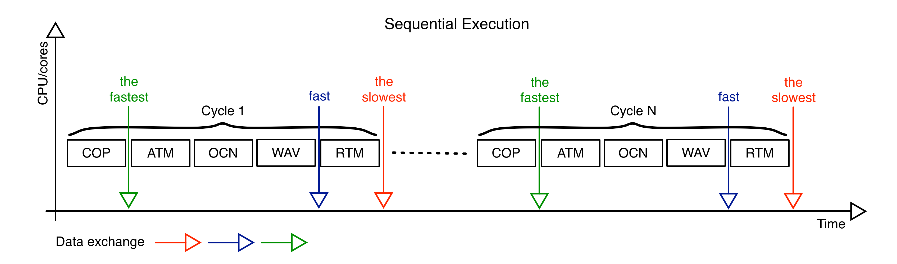
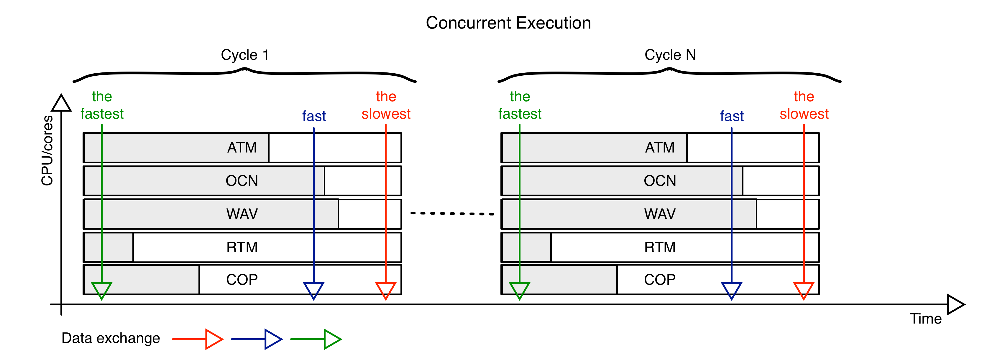

#Chapter 1: Model Design

**Reg**ional **E**arth **S**ystem **M**odel (RegESM) is designed to be a state-of-art coupled modeling system that allows using variety of different earth system model components as well as their integration with co-processing tool. It also supports easy to plug new sub-components by using its simplified interface. In this case, developers from different disciplines might easily adapt their sub components like wave, ice, land surface models to the modeling system by following the common conventions, which is used in RegESM modeling system.

The designed modeling system currently includes four different model components and one component for co-processing, which are coupled using [ESMF](https://www.earthsystemcog.org/projects/esmf/) (Earth System Modeling Framework):

* Atmosphere (ATM):
    * [RegCM](http://gforge.ictp.it/gf/project/regcm/) version >4.5 (it needs extra patch for co-processing)
    * [WRF](http://www2.mmm.ucar.edu/wrf/users/download/get_source.html) version 3.8.1 (under development)
* Ocean (OCN): 
    * [ROMS](http://www.myroms.org) revision 809
    * [ROMS-Ice](https://github.com/kshedstrom/roms): The driver is not tested with new CICE implementation !!!
    * [MITgcm](http://mitgcm.org/download/) version c63s 
* River Routing (RTM): 
    * [HD](http://www.mpimet.mpg.de/en/science/the-land-in-the-earth-system/terrestrial-hydrology/hd-model.html) version 1.0.2
* Wave (WAV):
    * [WAM](http://journals.ametsoc.org/doi/pdf/10.1175/1520-0485(1988)018%3C1775:TWMTGO%3E2.0.CO%3B2) version Cycle\_4.5.3\_MPI
* Co-processing (COP):
    * [ParaView](http://www.paraview.org) version 5.3.0: It requires [Catalyst](http://www.paraview.org/in-situ/) module and also GPU with graphics mode enabled.

The main aim is to use ESMF library is to standardize the coupling interfaces and having efficient interaction among the model components. The key component of the coupled modeling system is the "driver" (or "coupler"), which is basically responsible to synchronize the model components and define the interaction (via exchange fields) among them. In general, the transferred exchange fields depend on the interaction between the activated model components and the desired application itself. In the design of RegESM, a configuration file (exfield.tbl) is created to allow wide variety of applications and to modify list of exchange variables easily. The information about the definition of the exchange fields between the modeling components can be seen in [Section 3](03_Installation.md).

The design of the RegESM mainly follows the common conventions. In this case, the RegESM is designed as an orchestrator to control the plugged sub-components. and called as **driver**. The driver basically has no code related with the physical sub-models and it just include the definition of the **Initialize**, **Run** and **Finalize** routines, numerical grid information of model components (masking, grid coordinates and decomposition properties) and time information to achieve synchronization among the components.

The RegESM modeling system uses Earth System Modeling Framework ([ESMF](https://www.earthsystemcog.org/projects/esmf/)) as a coupler library to connect variety of standalone earth system models. In this case, each component is assigned as a gridded component and the interaction between them is defined using connectors defined by The National Unified Operational Prediction Capability ([NUOPC](https://www.earthsystemcog.org/projects/nuopc/)) interface.

The interaction of the main components can be seen in Fig. 1.

|  |
|:---:|
| **Figure 1.** Design of RegESM modeling system. **a)** components and **b)** currently supported coupling directions. The arrows indicate the interaction direction between the sub-components. |

## Multiple Coupling Time Step

The current design allows to define different coupling intervals (time steps) among the sub-components (i.e. fast and slow time steps). This has critical importance due to the response time of the components and the physical processes, which can be in different time scales. To that end, it is better to have a flexible modeling system that allows different coupling interval among the model components. 

For example, in Fig. 2, the river routing component (RTM) is interacting with atmosphere (ATM) and ocean (OCN) components with 1-day interval but OCN, ATM and wave (WAV) components exchange data (i.e. sea surface temperature, heat and momentum fluxes) in 3-hour interval. In this case, the driver component is able to define multiple time intervals for data exchange in a efficent way. Also note that the current implementation of the coupled model does not allow to setup different coupling time step between ATM-OCN, OCN-ATM, ATM-WAV and WAV-ATM coupling directions. The WAV component must use same coupling interval with the ATM and OCN components.

|  |
|:---:|
| **Figure 2.** An example run sequence defined for four model components (atmosphere, ocean, river and wave). |

## Model Execution Types
The components of the modeling system can be activated or deactivated easily using top level configuration file of driver ([namelist.rc](../namelist.rc)). The configuration file is also responsible for distributing computing resource (CPUs) to the model components. In this case, model components can be also configured to run in different number of processors (or cores) in a concurrent way. To that end, the current design of the modeling system supports both sequential and concurrent execution of the model components (Fig. 3-4).

|  |
|:---:|
| **Figure 3.** Sequential execution. |

In sequential execution mode, all model components and also driver have access to all the available computing resource except RTM component. RTM component shares last core with the OCN component (unless it is defined to have additional core in driver namelist file) because it is not parallelized using MPI and it uses only one core (very cheap and coarse model). In this mode, models are executed in an order and each one of the model components waits others to finish to run again. After executing model components in sequential manner, the models exchange the data and start to run again in an ordered fashion until next data exchange time. This can be seen in the upper part of the Fig. 3.

|  |
|:---:|
| **Figure 4.** Concurrent execution. The grey areas represents the runtime of the individual components. In case of load-balance conditions, the size of grey areas will be same. |

The coupled model also supports concurrent execution mode. In this case, each model component uses its own computing resource or set of CPUs/cores (RTM component can be configured to have its own resource or not, see the details of [namelist.rc](../namelist.rc) in [Section 4](04_Usage.md)) and driver. The driver uses all available cores among  the components to exchange data, perform interpolation or redistributing. The driver can be configured to assign different number of CPUs/cores for each model component using its configuration file ([namelist.rc](../namelist.rc)).