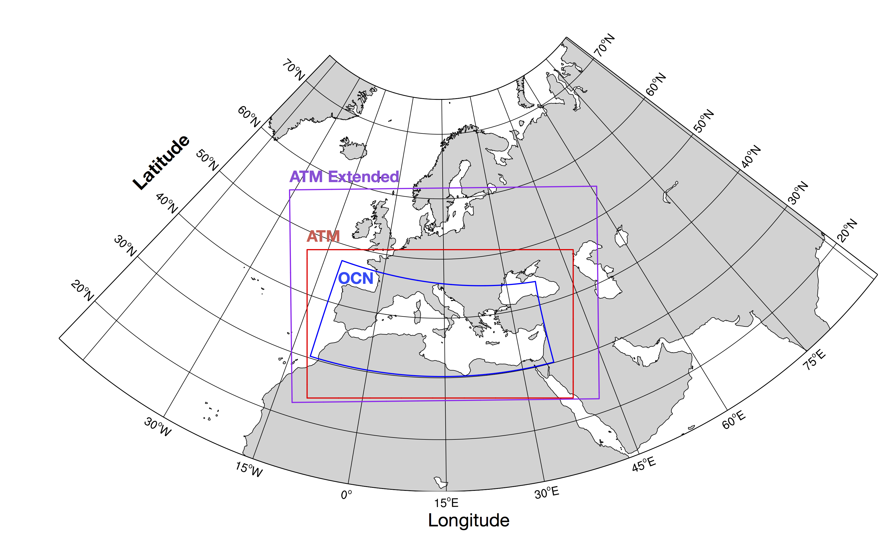
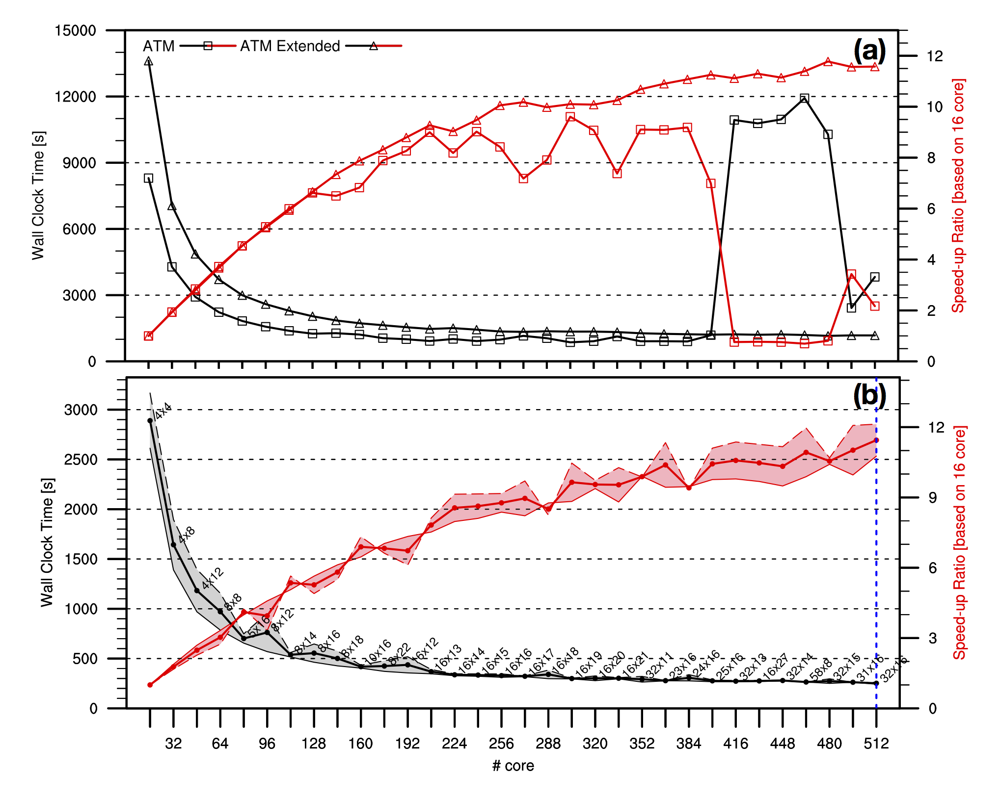
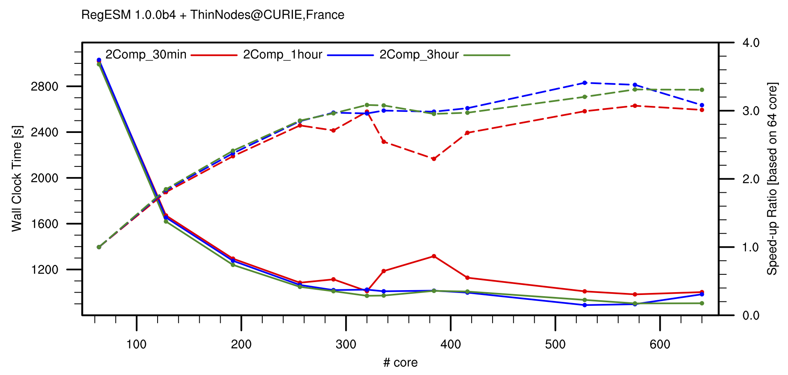
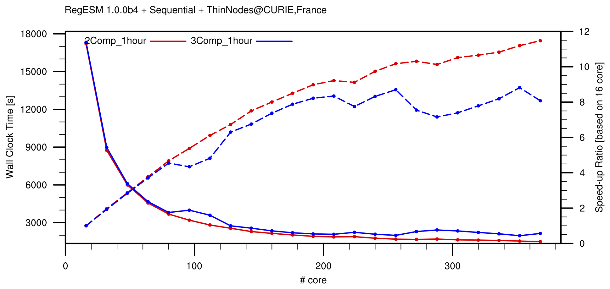
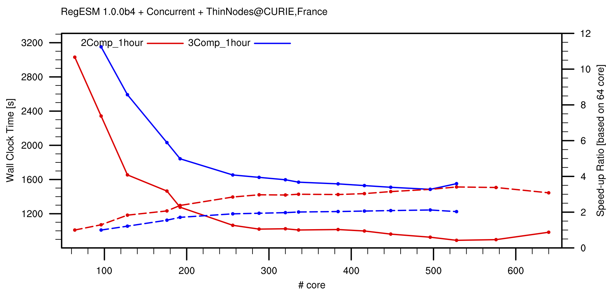

# Chapter 2: Benchmark

This section mainly aims to give detaied information about the benchmark results performed with different workload and also computing environment. The results that are presented here will also include details about used model components (i.e. versions, domain configuration etc.) as well as driver configuration and the computing resource.

## 2.1 Three component case: ATM-OCN-RTM

**Note:** All the tests in this section are performed between 16 Feb. and 15 Apr., 2015 @ CURIE provided by Très Grand Centre de Calcul (TGCC), France through PRACE Preparatory Call Type A grant 2010PA2442 [1].

The designed state-of-art modeling system, RegESM, is extensively tested in a high performance computing system provided by the collaboration of Très Grand Centre de Calcul ([TGCC](http://www-hpc.cea.fr/en/complexe/tgcc-curie.htm)) France and Partnership for Advanced Computing in Europe ([PRACE](http://www.prace-ri.eu)) project. The performance tests basically aim to find potential pitfalls and bottlenecks in the designed modeling system and include analysis of the effect of coupling time step, number of used components and coupling type (sequential and concurrent) over the overall performance of the coupled modeling system. To scale up to large number of processors, the horizontal resolution of atmospheric domain is increased to 12 km from 50 km and two different atmosphere model domain are defined (standard and extended). The rest of the atmospheric model configuration kept same for the atmospheric model component (RegCM). To reveal the overhead of the driver component, first individual model components are tested in standalone mode and then the best scaled model configurations are used in the coupled model simulations. The length of the simulations kept relatively short (5 days) to perform many simulations with different model configurations and domain decomposition parameters. The tested model domains can be seen in Figure 1. In this case, two different atmospheric model domains (ATM and ATM-Extended) to see the effect of the atmospheric model domain size in the benchmark results.

|  |
|:---:|
| **Figure 1.** Domain for the RegESM simulations used in benchmark tests. The atmospheric model has two different model domain: **1)** 12 km horizontal resolution extended (solid violet box) and **2)** 50 km horizontal resolution standard (solid red box). The ocean model domain (1/12°) is indicated with solid blue box. |

### 2.1.1 Benchmark of Standalone Model Components

The benchmark results of the standalone atmospheric and ocean components can be seen in Figure 2. The results show that the atmospheric model (RegCM) scales pretty well if the chunks of two-dimensional decomposition is big enough to feed the processors (Fig. 2a). It is evident that the atmospheric model scales better for extended domain (ATM-Extended) than original configuration (ATM) of the atmospheric component. The results also show that the tile parameters for each direction (x and y) do not affect the performance results of the atmospheric model. It is also observed that the fat nodes (on CURIE, France) scale better than the thin nodes when the number of processor is increased (tested only for standard atmospheric model domain).
 
|  |
|:---:|
| **Figure 2.** Benchmark results (wall-clock time is in the right and speed-up based on 16 cores is in the left) of standalone atmosphere (RegCM; 4.4.5.2) and ocean models (ROMS; r737) on CURIE thin nodes. The two different atmospheric model domain in tested: **1)** ATM and **2)** ATM Extended at 12 km horizontal resolution. The 1/12° horizontal resolution OCN domain is used in this case. The grey and red areas in bottom plot show the performance of the ocean model with different 2d decomposition configuration (tile in x and y directions). The black solid lines indicate wall clock time and red solid lines shows speed-up ratios. The simulation length is 5 days in both atmosphere and ocean model. |

Similar to atmospheric model component, the ocean model (ROMS) is also tested to find the best tile (x and y direction) configuration in terms of overall performance and the scalability of the ocean model component. As it can be seen from the Fig. 2b, and as it expected, the selection of the tile configuration affects the performance of the ocean model. In general, model scales better if tile in x direction is bigger than tile in y direction but this is more evident in the small number of processor. The result is mainly due to the memory management of Fortran (column-major order). The number of the land grid points found in each tile also plays role in the performance of the ocean model. On the other hand, the tile options must be selected carefully while considering the dimension of the model domain in each direction. In some tile configuration, it is not possible to run the ocean model due to the used algorithm and the required minimum number of ghost points (or halo regions in ESMF terminology). To summarize, the current configuration of ocean model scales well until 400 cores but after this threshold, the performance gain from the ocean model is limited for the current configuration and the size of the domain are considered. It is expected that the higher resolution (both in horizontal and vertical) of ocean component probably gives better scaling results.

### 2.1.2 Benchmark of Coupled Modeling System

Using the performance analysis of standalone atmosphere and ocean model components (only ROMS is tested), the performance of the fully coupled earth system model can be analyzed to investigate the coupling overhead under specified conditions. In this case, the best tile options of the ocean component is used in the coupled model simulations. The performance tests are performed using different coupling intervals (30-min, 1-hour and 3-hours), coupling types (sequential and concurrent) and number of active components (ATM-OCN and ATM-OCN-RTM). The results of wave component are not provided in here because wave component was not ready during the allocation period. The initial tests with the wave model show that the parallelization technique (distributed 1d arrays) of the model prevents to use more than 40 processors in Mediterranean Sea configuration (horizontal resolution is 1/8°). In this case, the concurrent type of model coupling can be used to get better scaling results but the wave model is computationally heavy especially for the higher number of direction and frequency bins and might affect the overall performance of the modeling system but this will be tested in the future.

#### Coupling Interval

In general, coupling interval affects the overall performance of the coupled modeling system because the driver performs interpolation (custom two step interpolation that also includes extrapolation to fill the unmapped grid points due to the unaligned land-sea masks among the model components) between the model components in each coupling interval due to the differences in the horizontal grid resolutions. The ESMF library basically calculates and stores the weight matrixes (called as routehandle in ESMF terminology) for each different combination of the exchange directions at the beginning of the simulation and use it when the model needs data exchange. Then, ESMF performs sparse matrix multiplication (SMM) operation in parallel to transfer the data from one computational grid to another.

##### Concurrent:

Fig. 3 shows the collected wall-clock time measurements of three different tests (30-min, 1-hour and 3-hour) of two component model configuration (ATM-OCN) in concurrent execution mode. In this case, each model component has its own MPI communicator and resources and all components run concurrently for every coupling interval until they need to exchange data. It is obvious that every component must have same speed to get the best performance from the modeling system. Otherwise, components might need to wait others until they are ready to exchange the information and causes overall performence loss in the modeling system. The results of standalone model simulations show that atmospheric model is 4.5-5.0 times slower than the ocean model for extended case. For standard case, this difference is smaller and reduces upto 2.6-3.7 times. To get the best performance form the coupled model, the execution times of the individual model components must be considered before asaigning the computing resources to the model components. As it can be seen from the figure, the models with different coupling interval show very similar scaling behavior.

|  |
|:---:|
| **Figure 3.** Effect of coupling interval (30 minutes, 1 hours and 3 hours) in the performance of the RegESM coupled model on CURIE thin nodes. The speed-up is calculated based on 64 cores. In this case, only ATM and OCN components are used and the RTM component is not activated. The simulation length is 5 days. |

The case that has 30 minutes coupling interval shows small fluctuations around 350-400 cores but this might be related with the network or I/O overload in the cluster system in that particular time. In overall, the effect of the coupling time step is limited and fluctuates around 7.5-10.0% when the results are compared with the fastest run (see following table). The results also show that the overhead of the coupling time step is smaller in the lower number of cores (1.2-5.0%). It is also shown that the tested configuration (with extended atmospheric model domain) of the coupled model scales up to 512 cores in thin nodes without any particular performance problem. The comparison of the results of the standalone model components and the results collected with Allinea’s MAP tool show that the coupling overhead is around 3.0-5.0% of the total execution time. The results also reveal that coupling overhead reduces with increased number of processor, which is mainly due to the parallel SMM operations. The better scaling results can be achieved by increasing horizontal resolution of ocean component from 1/12° to 1/16° and vertical resolution from 32 sigma layers to 48 or 64.

The calculated overhead of coupling time step can be seen in following table. In this case, the overhead is calculated using ((Tmax- Tmin)/Tmin)*100 equation. 

| **Total (#core)** | **ATM (#core)** | **OCN (#core)** | **Overhead (%)** |
|:-----------------:|:---------------:|:---------------:|:-----------------|
| 64                | 48              | 16 (4x4)        | 1.29             |
| 128               | 96              | 32 (4x8)        | 3.23             |
| 192               | 144             | 48 (4x12)       | 4.38             |
| 256               | 192             | 64 (8x8)        | 3.47             |
| 288               | 208             | 80 (5x16)       | 10.23            |
| 320               | 240             | 80 (5x16)       | 5.55             |
| **336**           | **240**         | **96 (8x12)**   | **22.01**        |
| **384**           | **288**         | **96 (8x12)**   | **29.89**        |
| 416               | 304             | 112 (8x14)      | 13.04            |
| 528               | 384             | 144 (8x18)      | 13.50            |
| 576               | 384             | 192 (8x24)      | 9.57             |
| 640               | 384             | 256 (16x16)     | 10.77            |

The calculated average overhead is 10.58% (it is 7.5% if two worse perfromance - 336 and 384 - are not considered).

#### Number of Active Model Component

In addition to analyze the performance of the two component case (ATM-OCN), the three component case (ATM-OCN-RTM) is also tested to reveal the overhead of the RTM component, which is a sequential code. In this case, the modeling system is run with both **sequential** and **concurrent** mode to gain insight about the performance improvement in the **concurrent** mode.

##### Sequential:

As it can be seen from the Fig. 4, the **RTM** component has significant impact in the overall performance of the coupled modeling system and reduces the performance around 20%. In this case, the scaling results are mainly worse then two component case and the impact of the **RTM** component will be more dominant when total number of processor is increased. The main reason of the scaling problem is to use sequential and low resolution (both temporal and spatial) **RTM** component. In this case, last available processor (or PET) is also used by the **RTM** component, which is shared with **OCN** component.

|  |
|:---:|
| **Figure 4.** Comparison of two (**ATM-OCN**) and three components (**ATM-OCN-RTM**) **sequential** configuration of RegESM coupled model on CURIE thin nodes. The speed-up is calculated based on 16 cores. In this case, only ATM and OCN components are used and the RTM component is not activated. The best 2d decomposition configuration is used in OCN component. The simulation length is 5 days and coupling time step is set to 1 hour. |

##### Concurrent:

Similar to sequential test case, the effect of **RTM** component is also analized for concurrent type coupling (Fig. 5). Also note that the RTM component still runs on last used processor of **OCN** model component. The lower processor counts, the execution time of the coupled modeling system in **concurrent** case is improved when it is compared with the results of the **sequential** type of coupling. The results show that the performance loss due to the **RTM** component is more apperent in the **concurrent case** and reaches upto 40% (ranges between 30-75).

|  |
|:---:|
| **Figure 5.** Comparison of two (**ATM-OCN**) and three components (**ATM-OCN-RTM**) **concurrent** configuration of RegESM coupled model on CURIE thin nodes. The speed-up is calculated based on 16 cores. In this case, only ATM and OCN components are used and the RTM component is not activated. The best 2d decomposition configuration is used in OCN component. The simulation length is 5 days and coupling time step is set to 1 hour. |

**Note:** In the future, we are planing to change the RTM component to support higher spatial and temporal representation of basins. In this case, we are considering the posibility to use [RAPID](https://github.com/c-h-david/rapid) model.

## 2.2 Co-processing Component: ATM-OCN-COP




## Acknowledgments
**[1]** We also acknowledge PRACE for awarding us access to resource CURIE based in France at Très Grand Centre de Calcul (TGCC) under project number 2010PA2442 to perform large scale performance tests. 

