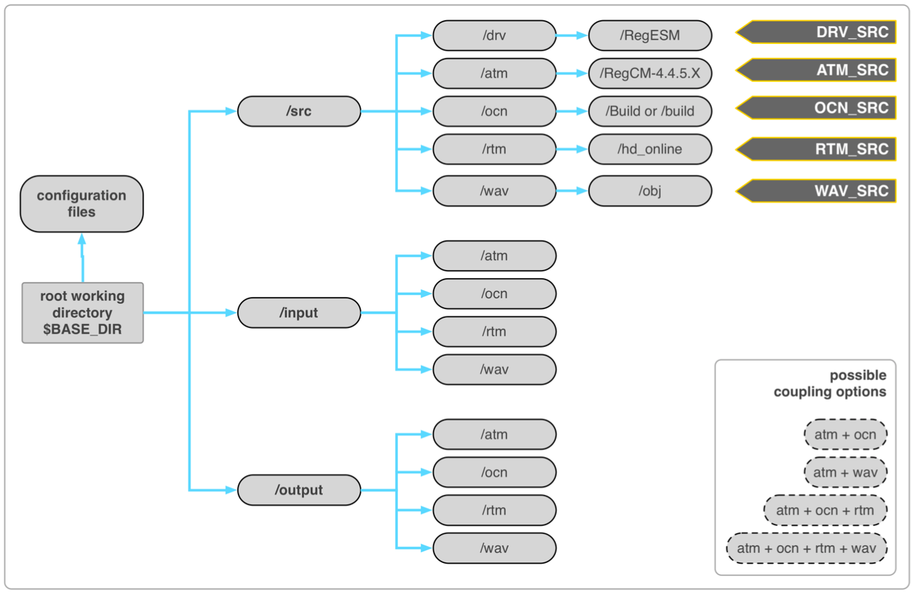

#Chapter 3: Installation

The basic requirements of the installation processes of the RegESM can be divided into three main sections:

1. **Preparing Working Environment:** In this case, set of external software libraries (i.e. [NetCDF](https://www.unidata.ucar.edu/software/netcdf/), [ESMF](https://www.earthsystemcog.org/projects/esmf/) etc.) should be installed or available in the host system that will be used to run the coupled model.

2. **Installing Model Components with Coupling Support:** Each model components (i.e. [RegCM](https://gforge.ictp.it/gf/project/regcm/), [ROMS](https://www.myroms.org) or [MITgcm](http://mitgcm.org), [HD](http://www.mpimet.mpg.de/en/science/the-land-in-the-earth-system/working-groups/terrestrial-hydrology/hd-model/) and [WAM](http://journals.ametsoc.org/doi/pdf/10.1175/1520-0485(1988)018%3C1775:TWMTGO%3E2.0.CO%3B2)) must be installed with coupling support. Due to the various design of the standalone model components, the coupling support are achieved by different ways.

    * The latest version of RegCM (4.6) can be used as a model component in RegESM without doing any extra modification or applying patch (just compile with --enable-cpl option). In case of using COP component, user need to apply a patch to RegCM model. 
    
    * In case of using ROMS (revision 809) as a ocean model component, user needs to apply a lightweight patch to enable coupling support. The patch basically used to overwrite the forcing data read from the input files in the memory. We are also colaborating with ROMS developers to integrate modifications directly into ROMS model. This will be available in the near future.
    
    * Unlike, RegCM and ROMS, MITgcm has an additional module that allows coupling. If there is a plan to use MITgcm as an ocean component, please contact with the developer. We are also working on standardizing the interface and developing MITgcm package for RegESM coupling. This will be available in the near future.

    * The HD and WAM models have extensive modifications and both of them are provided separately in case of any user request. Please fell free to contact with the developer.

    * There is no need to any patch or external file to activate the co-processing support but atmospheric model component needs to be patched.

3. **Installing RegESM:** In the last step, model components are merged into single executable using driver. The driver mainly controls the model components and interactions among them.

## 3.1. Preparing Working Environment

This section includes detailed information about the installation of required libraries and tools on a Linux based environment. The users also note that the installation procedure might change based on the used computing environment, compiler and MPI version.

The user defined **PROG** environment variable, which is used in this section, is mainly indicates the directory for the installation of external tools and libraries.

**A helper script for installation of the dependencies is basically provided along with the RegESM source code and can be accesses from [here](https://github.com/uturuncoglu/RegESM/blob/master/install-deps.sh).**

### 3.1.1. Hierarchical Data Format (HDF5)

Before installation of [HDF5](https://www.hdfgroup.org/HDF5/) library, it is necessary to install a compression library. The HDF5 supports both [zlib](http://zlib.net) and [szip](https://support.hdfgroup.org/ftp/lib-external/szip/2.1.1/src/szip-2.1.1.tar.gz) libraries but in this document we prefer to install zlib instead of szip library.

To install zlib:

```
cd $PROGS
wget http://zlib.net/zlib-1.2.8.tar.gz 
tar -zxvf zlib-1.2.8.tar.gz
cd zlib-1.2.8
export CC=icc
export FC=ifort
./configure --prefix=`pwd`
make
make install
```

To install HDF5:

```
cd $PROGS
wget https://support.hdfgroup.org/ftp/HDF5/releases/hdf5-1.8.11/src/hdf5-1.8.11.tar.gz
tar -zxvf hdf5-1.8.11.tar.gz
./configure --prefix=`pwd` --with-zlib=$PROGS/zlib-1.2.8 --enable-fortran --enable-cxx CC=icc FC=ifort CXX=icpc
make
make install
```

### 3.1.2. Network Common Data Form (NetCDF)

The [NetCDF](https://www.unidata.ucar.edu/software/netcdf/) library is distributed separately for each programming language. Because of this restriction, it is necessary to follow specific order to install netCDF C (4.3.0), C++ (4.2) and Fortran (4.2) libraries.

To install C interface:

```
cd $PROGS
wget ftp://ftp.unidata.ucar.edu/pub/netcdf/old/netcdf-4.3.0.tar.gz
tar -zxvf netcdf-4.3.0.tar.gz
cd netcdf-4.3.0
mkdir src
mv * src/.
cd src
./configure --prefix=$PROGS/netcdf-4.3.0 CC=icc FC=ifort LDFLAGS="-L$PROGS/zlib-1.2.8/lib - L$PROGS//hdf5-1.8.11/lib" CPPFLAGS="-I$PROGS/zlib-1.2.8/include -I/$PROGS/hdf5- 1.8.11/include"
make
make install
export LD_LIBRARY_PATH=$PROGS/netcdf-4.3.0/lib:$LD_LIBRARY_PATH
```

To install C++ interface:

```
cd $PROGS
wget ftp://ftp.unidata.ucar.edu/pub/netcdf/netcdf-cxx-4.2.tar.gz
cd netcdf-cxx-4.2
mkdir src
mv * src/.
cd src
./configure --prefix=$PROGS/netcdf-cxx-4.2 CC=icc CXX=icpc LDFLAGS="-L$PROGS/zlib-1.2.8/lib - L$PROGS/hdf5-1.8.11/lib -L$PROGS/netcdf-4.3.0/lib" CPPFLAGS="-I$PROGS/zlib-1.2.8/include - I/$PROGS/hdf5-1.8.11/include -I$PROGS/netcdf-4.3.0/include"
make
make install
```

To install Fortran interface:

```
cd $PROGS
wget ftp://ftp.unidata.ucar.edu/pub/netcdf/netcdf-fortran-4.2.tar.gz
cd netcdf-fortran-4.2
mkdir src
mv * src/.
cd src
./configure --prefix=$PROGS/netcdf-fortran-4.2 CC=icc FC=ifort LDFLAGS="-L$PROGS/zlib-1.2.8/lib - L$PROGS/hdf5-1.8.11/lib -L$PROGS/netcdf-4.3.0/lib" CPPFLAGS="-I$PROGS/zlib-1.2.8/include - I/$PROGS/hdf5-1.8.11/include -I$PROGS/netcdf-4.3.0/include"
make
make install
```

Then, link content of include and library folders of C++ and Fortran under C interface installation directory to use all the libraries from single location (NETCDF environmant variable).

```
cd $PROGS/netcdf-4.3.0/lib
ln -s ../../netcdf-cxx-4.2/lib/* .
ln -s ../../netcdf-fortran-4.2/lib/* .
ln -s ../../netcdf-cxx-4.2/include/* .
ln -s ../../netcdf-fortran-4.2/include/* . 
export NETCDF=$PROGS/netcdf-4.3.0
export PATH=$NETCDF/bin:$PATH
```

### 3.1.3. Parallel NetCDF (optional)

This step is optional but if there is a plan to use ESMF NetCDF I/O capabilities to write exchange fields to disk through the use of [parallel-netcdf](https://trac.mcs.anl.gov/projects/parallel-netcdf) library (1.3.1) is required.

```
cd $PROGS
wget http://ftp.mcs.anl.gov/pub/parallel-netcdf/parallel-netcdf-1.3.1.tar.gz
tar -zxvf parallel-netcdf-1.3.1.tar.gz
cd parallel-netcdf-1.3.1
./configure --prefix=`pwd` --with-mpi=/opt/openmpi/1.6.5/intel/2013psm FC=mpif90 F77=mpif90 CXX=mpiccpc
make
make install
export PNETCDF=$PROGS/parallel-netcdf-1.3.1
```

Also note that the path for MPI installation and MPI implementation might change. In this case, user must supply correct path to “--with-mpi” configuration option.

### 3.1.4. Apache Xerces C++

This library is mainly required for ESMF installation. It is responsible to read/write grid definitions and attributes (field, component and state level) in XML format.

```
cd $PROGS
wget http://apache.bilkent.edu.tr//xerces/c/3/sources/xerces-c-3.1.1.tar.gz tar -zxvf xerces-c-3.1.1.tar.gz
cd xerces-c-3.1.1
./configure --prefix=$PROGS/xerces-c-3.1.1 CC=icc CXX=icpc
make
make install
```

### 3.1.5. Earth System Modeling Framework (ESMF)

The one of the main component of the coupled model is the coupling library, which is used to create driver to control the standalone model components. The detailed and up-to-date information of the installation procedure can be found [here](http://www.earthsystemmodeling.org/esmf_releases/last_built/ESMF_usrdoc/). 

Before starting to the installation of ESMF library, the users need to pay attention to the following issues;

* The coupled model needs special features of ESMF (>7.1.0b20). 
* If there is a plan to use the debug level (>2) to check the exchange fields, then ESMF library might be installed with parallel I/O and netCDF support (for more information, look at the example environment variables defined in ESMF installation related with NETCDF and PNETCDF).
* After netCDF version 4.3.0 the C++ interface is changed and ESMF is not compatible with it. So, it is better to use the <= 4.3.0 version of netCDF in this case.

Example environment variable definitions (sh/bash shell) for ESMF installations:

```
export ESMF_OS=Linux
export ESMF_TESTMPMD=OFF
export ESMF_TESTHARNESS_ARRAY=RUN_ESMF_TestHarnessArray_default
export ESMF_TESTHARNESS_FIELD=RUN_ESMF_TestHarnessField_default
export ESMF_DIR=/okyanus/users/uturuncoglu/progs/esmf-7.1.0b20
export ESMF_TESTWITHTHREADS=OFF
export ESMF_INSTALL_PREFIX=$PROGS/esmf-7.1.0b20/install_dir
export ESMF_COMM=intelmpi
export ESMF_TESTEXHAUSTIVE=ON
export ESMF_BOPT=O
export ESMF_OPENMP=OFF
export ESMF_SITE=default
export ESMF_ABI=64
export ESMF_COMPILER=intel
export ESMF_PIO=internal
export ESMF_NETCDF=split
export ESMF_NETCDF_INCLUDE=$PROGS/netcdf-4.4.0/include
export ESMF_NETCDF_LIBPATH=$PROGS/netcdf-4.4.0/lib
export ESMF_XERCES=standard
export ESMF_XERCES_INCLUDE=$PROGS/xerces-c-3.1.4/include
export ESMF_XERCES_LIBPATH=$PROGS/xerces-c-3.1.4/lib
```

Also note that the environment variables must be changed to install ESMF library to other computing systems or clusters that use different MPI version and operating system. The detailed information about definition of environment variables for ESMF library can be found in [here](https://www.earthsystemcog.org/projects/esmf/platforms_6_3_0rp1) and [here](https://www.earthsystemcog.org/projects/esmf/daily_builds).

Then, following command can be used to compile and install ESMF,

```
cd $ESMF_DIR 
make >&make.log 
make install
```

After installation of the ESMF library, user can create a new environment variables like **ESMF_INC**, **ESMF_LIB** and **ESMFMKFILE** to help RegESM configure script to find the location of the required files for the ESMF library.

```
export ESMF_INC=$ESMF_INSTALL_PREFIX/include
export ESMF_LIB=$ESMF_INSTALL_PREFIX/lib/libO/Linux.intel.64.intelmpi.default
export ESMFMKFILE=$ESMF_INSTALL_PREFIX/lib/libO/Linux.intel.64.intelmpi.default/esmf.mk

```

At this level, it is always better to install ESMF library also with debug support (change **ESMF_BOPT** environment variable from **O** to **g** and install the library again after issuing make clean command). To have both optimized and debug version of ESMF library might help to find the source of the possible errors caused by the coupled model. Be aware that the production runs can be done with the optimized version of ESMF.

To install bit-to-bit reproducible version of the ESMF library, please read the [Section 6](06_Known_Issues.md).
## 3.2 Installation of Model Components

After installing the required libraries, the next step is installing individual model components with coupling support. In this case, user might install individual model components to any desired location (or path) in the file system and point out the installation directories in the configuration phase of the coupled model. At this level, it is strongly recommended that given suggestion in this document about the installation of the individual model components and driver itself can help to prevent most of the problems in the installation phase and help to fix them. Using hierarchical directory structure for the installation of the model components and driver helps to simplify the installation procedure. The following figure includes exmaple directory structure for the installation of RegESM.

| []() |
|:---:|
| **Figure 1.** Suggested directory structure for RegESM installation. | 

As it can be seen from the figure, each model components (including "driver" itself, which is called as "drv" in the figure) use its own directory for the source files, input and output. In addition to the directory structure, the configuration files, run script (OpenPBS, LSF etc.), input and output files can be placed in the main working directory (**BASE_DIR**). RegESM executable (**DRV_SRC**) placed in the working directory is the soft link and can be created with following commands, 

```
cd $BASE_DIR
ln -s $DRV_SRC/regesm.x
```

### 3.2.1 Regional Climate Model (RegCM)

To install RegCM with coupling support user must issue following commands,

```
mkdir $ATM_SRC
cd $ATM_SRC
wget https://gforge.ictp.it/gf/download/frsrelease/252/1580/RegCM-4.5.0.tar.gz
tar –zxvf RegCM-4.5.0.tar.gz
cd RegCM-4.5.0
./bootstrap.sh
./configure –prefix=`pwd` --enable-cpl CC=icc FC=ifort
make
make install
``` 

The **ATM_SRC** environment variable is used to point the installation directory of the atmospheric model and user might replace it by any valid directory name.
The command that is given here is for Intel Compiler and Linux operating system and might change in different working environment amd compiler. By design, the model components do not have any ESMF related code and user does not need to use ESMF library in the installation of the individual model components. All ESMF related code is placed in "driver" side (RegESM). To that end, the installation of the model is almost same as the standalone version except given extra configure option (**--enable-cpl**) to enable coupling support.

The additional configuration parameters (see Doc/README.namelist in the RegCM source directory) for the RegCM need to be activated when the model is running in the coupled mode and the interaction with other model components such as ocean, wave or both of them. In this case, the user need to use and turn on coupling related options in the RegCM configuration file.

**Physics parameters:**

```
&physicsparam
...
iocncpl = 1,
iwavcpl = 1,
...
```

In this case, **iocncpl** activates coupling with ocean model (ROMS or MITgcm) and **iwavcpl** coupling with wave model (WAM). In case of coupling both ocean and wave model, both options must be activated.

**Coupling parameters:**

```
&cplparam
cpldt = 10800.,
zomax = 0.005,
ustarmax = 1.2,
/ 
```

The coupling interval (in seconds) given with **cpldt** option must be consistent with the coupling interval defined in the driver namelist file (**namelist.rc**). Parameter **zomax** is the threshold for surface roughness. In addition to **zomax**, parameter **ustarmax** is the threshold for frictional velocity. In this case, both parameters are only valid for wave coupling. The threshold values for surface roughness (**zomax**) and frictional velocity (**ustarmax**) are used to keep atmospheric model stable and user might need to play with those number to find the reasonable values as large as possible.

### 3.2.2 Regional Ocean Model (WRF)

Implementation of the new atmospheric model component is still under development and there is a plan to release it around September, 2017. The new atmospheric model component will replace the existing one (RegCM) to solve the stability issues of coupled modeling system due to the problem in the implementation of the RegCM non-hydrostatic core, which is inherited from outdated MM5 code. We are expecting to have more stable modeling system expecially for very high resolution (< 3 km) applications along with WRF online nesting capablity.  

### 3.2.3 Regional Ocean Model (ROMS)

To install ROMS with coupling support, the user need to patch the original version of the model. The patch includes set of minor modifications to prepare ROMS ocean model for the coupling. The reader also notes that there is no any generic patch for the all versions ROMS due to the existence of the different versions and branches (i.e. [Rutgers University’s ROMS](https://www.myroms.org), [CROCCO (or AGRIF ROMS)](https://www.croco-ocean.org), [UCLA ROMS](http://research.atmos.ucla.edu/cesr/ROMS_page.html), [ROMS with sea-ice](https://github.com/kshedstrom/roms)) of the model. On the other hand, we are colaborating with Rutgers University to implement out-of-box support for ROMS model. There is a plan to have initial version of the Rutgers University’s ROMS soon.

The current version of the RegESM comes with patches that are created by using a snapshot of the [ROMS external branch with sea-ice support](https://github.com/kshedstrom/roms) and [Rutgers University’s ROMS (revision 809)](https://www.myroms.org). The user also note that the sea-ice branch has cpability of coupled with CICE model but this version is not tested with RegESM modeling system yet. All patches can be found under [here](https://github.com/uturuncoglu/RegESM/tree/master/tools/ocn). Applying the selected patch is simple and the given version of the patch can be used as a reference to modify the any possible future ROMS versions and revisions.

To get specific revision and to apply patch:

```
svn checkout -r 809 --username [USER NAME] https://www.myroms.org/svn/src/trunk roms-r809
cd roms-r809
wget https://raw.githubusercontent.com/uturuncoglu/RegESM/master/tools/ocn/roms-r809.patch
patch -p 3 < roms-r809.patch
```

**Do not forget to replace [USER NAME] in the commands***

To activate coupling in ROMS, user could add following CPP flags in the header file (*.h) created for specific application.

| CPP Flag | Description |
|:---:| :---:|
| REGCM_COUPLING | Activates coupling with atmospheric model component |
| MODIFIED_CALDATE | Fix bug in ROMS caldate subroutine |
| HD_COUPLING | Activates coupling with river routing model component |
| PERFECT_RESTART | It requires to restart the coupled modeling system (do not forgot to set the LcycleRST == F and NRST for daily restart output)|

Also note that **ATM_PRESS** and **SHORTWAVE** CPP options are suggested for realistic applications.

For installation of ROMS model and create a realistic application, please refer to ROMS [documentation](https://www.myroms.org/wiki/Documentation_Portal).

### 3.2.4 M.I.T General Circulation Model (MITgcm)

To install MITgcm (MITgcm_c63s) with coupling support, the user must need to activate the ESMF capability for MITgcm first. In case of using MITgcm model, please contact with the developer from [email to developer](mailto:ufuk.turucoglu@itu.edu.tr) for the modified MITgcm code to activate coupling under RegESM modeling system. The official [documentation](http://mitgcm.org/public/docs.html) of MITgcm can be used to install and create a realistic case. We are also colaborating with ocean modeling group in [Italian National Agency for New Technologies, Energy and Sustainable Economic Development (ENEA)](http://www.enea.it/en/home-luglio-2015?set_language=en&cl=en) to create external package for MITgcm model to distribute modificiations in a standardized and easy way.

### 3.2.5 HD 

The HD river routing model is the property of Max Planck Institute, Germany and it is distributed via a user agreement. So, it is not possible to distribute it freely along with the driver. In this case, our main philosophy is to create a specific patch for individual model components rather than distributing them along with the modeling system or tightly integrating them into RegESM to create a monolitic model. In RegESM design, we heavily modified the original HD model to allow coupling with RegESM easily. The following list summarizes the modification done by ITU (thanks to [Stefan Hagemann](http://www.mpimet.mpg.de/en/staff/stefan-hagemann/) from Max Plack Institue for his valuable comments, help and sharing the code).

* The file format of the model output and restart files are changed from binary (SRV format) to more generic data format (NetCDF).
* The model main code is splitted into three parts (initialization, run and finalize) to make available model coupling with ESMF library.
* The necessary modifications are done for the coupling to allow data exchange between model components. In this case, new preprocessor flag is added to model to activate coupling.
* A set of NCL functions is created to drive the standalone model using RegCM output and to create SRV formatted input files.

Because of the license restriction that is mentioned previously, the HD model and the modifications for the coupling are not distributed publicly via GitHub repository. If there is plan to use the three component modeling system, then user should get the license from the Max Planck Institute for the standalone version of the HD model and contact with the [developer](mailto:ufuk.turucoglu@itu.edu.tr) to get the modified version of the HD model to use in the coupled modeling system. The user also port his/her own RTM component to the coupled modeling system by following same methodology given the list and the help of the RegESM source code ([mod\_esmf\_rtm.F90](https://github.com/uturuncoglu/RegESM/blob/master/mod_esmf_rtm.F90)).

To install modified version of HD model with coupling support, user should edit the Makefile (basically add **-DCPL** preprocessor flag for model coupling) and issue following commands:

```
mkdir $RTM_SRC
tar –zxvf hd_online.tar.gz 
cd hd_online
make
make install
```

### 3.2.6 A Third Generation Ocean Wave Prediction Model (WAM)

The ECMWF’s [WAM](http://www.ecmwf.int/en/research/modelling-and-prediction/marine) version used in the coupled model is **Cycle\_4.5.3\_MPI**. The original version of WAM model is modified to add it as a component in the coupled modeling system. Again, due to the license restriction of the modeling system user need to contact with the [developer](mailto:ufuk.turucoglu@itu.edu.tr) to get the modified version of the WAM model.

To install modified version of WAM model with coupling support, user should issue following commands:

```
mkdir $WAM_SRC
tar -zxvf wav.tar.gz
cd mk
./create_binaries
```

**Note that user need to edit hidden .dirset file to change the installation path (PRODADMDIR) and FCFLAGS. In this case, the FCFLAGS must include -DCPL to activate coupling support. You might also need to modify the make_netcdf and pnetcdf.mk to point correct path for NetCDF library installation.**
 
## 3.3. Installation of RegESM

After installation of the individual model components such as RegCM, ROMS or MITgcm, the RegESM driver can be installed. The RegESM basically uses the object (\*.o), module (\*.mod) and header (\*.h) files of individual model components to create static library files such as libatm.a for atmosphere, libocn.a for ocean, librtm.a for river routing, libwav.a for wave model and libcop.a for co-processing component. The static libraries are used to create the single RegESM executable that able to run model components.

The ESMF library is required to compile ESMF related component codes in "driver" side. The configuration script basically tries to find the installation directory of ESMF library by looking for a specific environment variable (**ESMF\_LIB**). If **ESMF\_LIB** environment variable points the directory of ESMF shared library (libesmf.so) and configuration file (esmf.mk), then it uses them to compile the RegESM. In case of undefined **ESMF\_LIB** environment variable, user might specify the ESMF library directory by using **--with-esmf** configure option.

Currently, RegESM project is maintained and distributed by using a [GitHub repository](https://github.com/uturuncoglu/RegESM) under GNU GPL license. The documentation can be found under the [docs/](https://github.com/uturuncoglu/RegESM/tree/master/docs) directory. To open new issue ticket, bug report or feature request that are related with the driver, the GitHub page can be used. Due to the limitation of the human resource to develop and maintain the coupled modeling system, the solution of the possible bugs and issues can be delayed.

To install RegESM with four component (ATM, OCN, RTM and WAV):

```
cd $ESM_SRC
git clone https://github.com/uturuncoglu/RegESM.git
cd RegESM
./configure --prefix=$ESM_SRC/RegESM --with-atm=$ATM_SRC --with-ocn=$OCN_SRC/Build --with-rtm=$RTM_SRC –with-wav=$WAV_SRC/obj CC=icc FC=ifort
make
make install
```

If RegESM model is used with fewer components then the options given in the configure script can be modified based on the selected model components such as ATM-OCN, ATM-OCN-RTM, ATM-WAV. The configure options **--with-atm**, **--with-ocn**, **--with-rtm** and **--with-wav** are used to point the installation directories of the model components. For ROMS case, **--with-ocn** option must point "Build" directory that holds the compiled source files of the ROMS installation but "build" directory for MITgcm. For the wave component (WAV) "obj" directory must be given to **--with-wav**.

The configure script is smart enough to check some key files to find the correct ocean model component (ROMS, ROMS with sea-ice support or MITgcm) and compiles the required files suitable for selected model components. In addition, the configure script also checks the ROMS model installation directory to enable the sea-ice related part of the data exchange routines in the "driver" side. To that end, user does not need to set any other option when using sea-ice enabled ROMS version.

Also note that **$ESM\_SRC** is the main directory for RegESM installation.