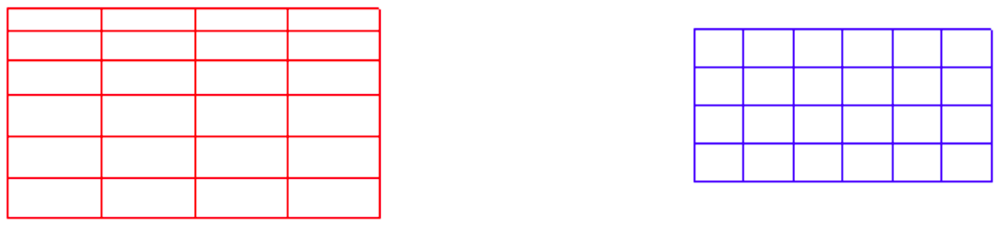

# Chapter 7: Known Issues

## 7.1 Two Level Interpolation

There is a know problem in the ESMF side and its nearest-neighbor interpolation support. The nearest-neighbor search causes error if the internal piece of the source grid is completely masked out on a processor. The problem appears along with the large and unrealistic values in the result field (at source grid) when specific number of processor is used. The number of processor that causes to the error depends on the grid size, land-sea masking and also number of tiles in each direction (x and y) that is used for the domain decomposition purposes. The problem exists in the ESMF library (**6.3.0r**) but it is fixed in the newer versions (**> 6.3.0r**).

## 7.2 Problem in Three Component Case

The ESMF library (version **< 7.0.0b38**) has a bug and the modeling system does not run as expected when three component case (**ATM+OCN+RTM**) is activated. The problem is in the NUOPC layer of the ESMF library but it is fixed in version **7.0.0b38**.

## 7.3 Unaligned and/or Mismatched Component Grids

In the current version of the coupled modeling system, numerical grid of the components (**OCN**, **RTM** and **WAV**) must be completely covered by the atmospheric model (**ATM**) grid and all the components should use the same convention for the definition of latitude (-90 to +90) and longitude (-180 to +180) limits. Due to the restriction, usage of different conventions in the definition of the component grids might produce error in the ESMF library when ESMF tries to create weight matrices (called routehandle in ESMF terminology) for the interpolation among the grid components.

The following error message is an example for the violation of latitude/longitude convention. In this case, atmosphere model uses -90 to +90 for latitude and -180 to +180 for the longitude but ocean model uses -90 to +90 for latitude and 0 to +360 for the longitude to define the numerical grids.

```
20150708 170134.569 ERROR PET47 ESMCI_Regrid_F.C:474 c_esmc_regrid_create() Internal error: Bad condition - Condition {sf.size() == rf.size()} failed at /home/netapp/clima- users/users/uturunco/progs/esmf-7.0.0b38/src/Infrastructure/Mesh/src/ESMCI_CommReg.C, line:108 20150708 170134.569 ERROR PET47 ESMF_Regrid.F90:321 ESMF_RegridStore Internal error: Bad condition - Internal subroutine call returned Error
20150708 170134.569 ERROR PET47 ESMF_FieldRegrid.F90:1035 ESMF_FieldRegridStoreNX Internal error: Bad condition - Internal subroutine call returned Error 20150708 170134.569 ERROR PET47 mod_esmf_cpl.F90:344 Internal error: Bad condition - Passing error in return code
20150708 170134.569 ERROR PET47 ATM-TO- OCN:src/addon/NUOPC/src/NUOPC_Connector.F90:1613 Internal error: Bad condition - Passing error in return code
20150708 170134.569 ERROR PET47 regesm:src/addon/NUOPC/src/NUOPC_Driver.F90:1190 Internal error: Bad condition - Phase 6 Initialize for connectorComp 1 -> 2: ATM-TO-OCN did not return ESMF_SUCCESS
20150708 170134.569 ERROR PET47 regesm:src/addon/NUOPC/src/NUOPC_Driver.F90:783 Internal error: Bad condition - Passing error in return code
20150708 170134.569 ERROR PET47 regesm.F90:107 Internal error: Bad condition - Passing error in return code
```

To be sure that the model components are totally covered by the atmospheric model, the user could set the debug level as 2 or higher in the coupler configuration file ([namelist.rc](../namelist.rc)) and run the model again. In this case, coupled modeling system creates set of files with *.vtk (Visualization Toolkit, [VTK](http://www.vtk.org)) extension. These files basically store the grid information of all the model components and grid stencils (cross, dot, u and v). By using visualization tools like [ParaView](http://www.paraview.org) and [VisIt](https://visit.llnl.gov), the generated VTK files can be read and checked. The following figure belongs to the case that produces error.

| []() |
|:---:|
| **Figure 1.**  Example grids of model components (red is atmosphere and blue is ocean) that use different longitude convention. The boxes with same color show domain decomposition elements of the model component. |

As it can be seen from the Fig. 1, the both grids use different convention in the definition of longitude coordinates. In this case, the ocean model grid (blue) does not match with the atmosphere grid (red) even they are seems overlapped with other visualization tools such as [NCL](https://www.ncl.ucar.edu).

## 7.4 Bit-to-bit Reproducibility

The bit-to-bit reproducibility becomes important in the scientific studies when user needs to compare the results of the different configurations of the same model simulation to check the effects of the different components. The bit-to-bit reproducibility is still active research area in the earth system science and needs special attention to the used model components and the working environment (i.e. operating system, compiler). The issue is mainly related with the floating-point arithmetic and the representation of the numbers in the computer (it has a finite resolution to store the numbers). Due to this reason, numerical results change run to run of the same executable. Numerical results also change between different systems. For example, using same operating system along with different CPU version (Intel® Xeon® Processor E5540 vs. Intel® Xeon® Processor E3-1275) probably affect the results. The problem could be caused by different reasons: the algorithm, alignment of the data in heap and stack (kind of memory), task or thread scheduler in OpenMP and MPI parallelism. The order of the numerical operations has also impact on the rounded results (i.e. reduction operator in MPI code).

The RegESM model is able to generate bit-to-bit reproducible results when specific compiler flags are used to compile/install the model components and also ESMF library. For Intel compiler, there are specific compiler flags to ensure bit-to-bit reproducibility such as **-fp-model precise** and **-fp-model source**. Note that the compiler flag (**-fp-model precise**) controls the numerical operations to achieve the bit-to-bit reproducibility but it might reduce the overall performance of the model components and the driver by %5-10. More information about the issue can be found in the following references:

1. Song-You Hong, Myung-Seo Koo, Jihyeon Jang, Jung-Eun Esther Kim, Hoon Park, Min- Su Joh, Ji-Hoon Kang, and Tae-Jin Oh, 2013: An Evaluation of the Software System Dependency of a Global Atmospheric Model. Mon. Wea. Rev., 141, 4165–4172. [here](http://journals.ametsoc.org/doi/abs/10.1175/MWR-D-12-00352.1)

2. Liu, L., Li, R., Zhang, C., Yang, G., Wang, B., and Dong, L.: Enhancement for bitwise identical reproducibility of Earth system modeling on the C-Coupler platform, Geosci. Model Dev. Discuss., 8, 2403-2435, doi:10.5194/gmdd-8-2403-2015, 2015. [here](http://www.geosci-model-dev-discuss.net/gmd-2015-33/)

3. [http://scienceblogs.com/stoat/2013/07/29/repeatability-of-large-computations/](http://scienceblogs.com/stoat/2013/07/29/repeatability-of-large-computations/)

4. [http://www.easterbrook.ca/steve/2010/09/verification-and-validation-of-earth-system-models/](http://www.easterbrook.ca/steve/2010/09/verification-and-validation-of-earth-system-models/)

5. [https://software.intel.com/en-us/articles/consistency-of-floating-point-results-using-the-intel-compiler](https://software.intel.com/en-us/articles/consistency-of-floating-point-results-using-the-intel-compiler)

6. [http://www.eecs.berkeley.edu/~hdnguyen/public/talks/IWASEP9.pdf](http://www.eecs.berkeley.edu/~hdnguyen/public/talks/IWASEP9.pdf)

**The modifications for ESMF:**

To install ESMF library along with the support of bit-to-bit reproducibility, user needs to modify build_rules.mk configuration file (under build_config/ directory in the ESMF source code). The memory model of the compiler defined in ESMF (x86_64_32, x86_64_small, x86_64_medium, x86_64_mic, ia64_64) could change based on the used system and its architecture. In the following example, it is x86_64_small. In this case, following modifications must be done before installing ESMF library.

**The original build\_config/Linux.intel.default/build\_rules.mk file:**

```
...
...
ifeq ($(ESMF_ABISTRING),x86_64_small)
ESMF_CXXCOMPILEOPTS += -m64 -mcmodel=small
ESMF_CXXLINKOPTS += -m64 -mcmodel=small
ESMF_F90COMPILEOPTS += -m64 -mcmodel=small
ESMF_F90LINKOPTS += -m64 -mcmodel=small
endif 
... 
...
```

**The modified build\_config/Linux.intel.default/build\_rules.mk file:**

```
...
...
ifeq ($(ESMF_ABISTRING),x86_64_small)
ESMF_CXXCOMPILEOPTS += -m64 -mcmodel=small -fp-model precise
ESMF_CXXLINKOPTS += -m64 -mcmodel=small -fp-model precise
ESMF_F90COMPILEOPTS += -m64 -mcmodel=small -fp-model precise
ESMF_F90LINKOPTS += -m64 -mcmodel=small -fp-model precise
endif 
... 
...
```

Then, ESMF library can be installed as usual. Also note that ESMF_DIR and ESMF_LIB and ESMF_INC environment variables might be changed based on the new installation. The ESMF installed with “-fp-model precise” option will support bit-to-bit reproducibility.

**The modifications for Model Codes:**

After installation of ESMF library, all the model components must be installed with **-fp-model precise** compiler flag (Intel). **The RegCM version < 4.4.5.7 could have -fp-model fast=2 by default** for better optimization but it is very dangerous. If this is the case, user must edit configure.ac to change **-fp-model fast=2** to **-fp- model precise**. Then, **bootstrap.sh** script must be executed to create modified configure script.

## 7.5 Problem in SST Update for RegCM coupling

The diurnal cycle SST scheme (**idcsst**) must be deactivated (set to 0) along with the ocean model coupling. It basically overwrites the SST data come from ocean component and might create strange results in the model. This problem exists in all **RegCM 4.4.X.X** versions. The new control will be added to **RegCM 4.5** to automatically disable diurnal cycle SST scheme when the coupling is activated (**iocncpl = 1**).
